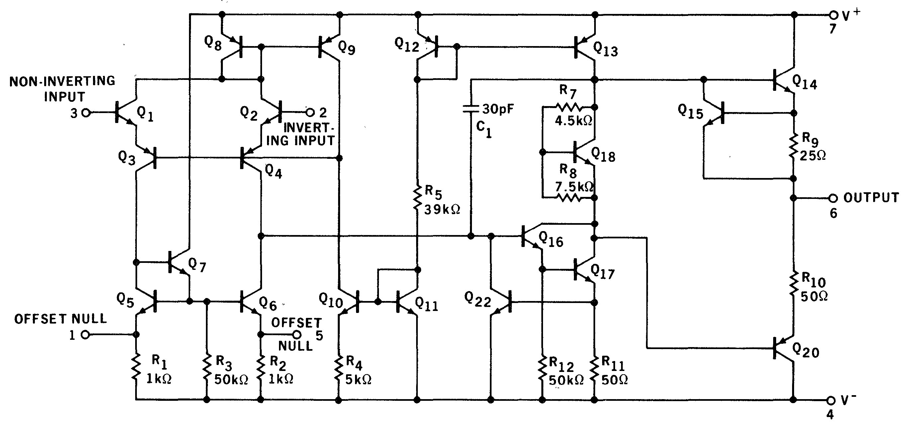
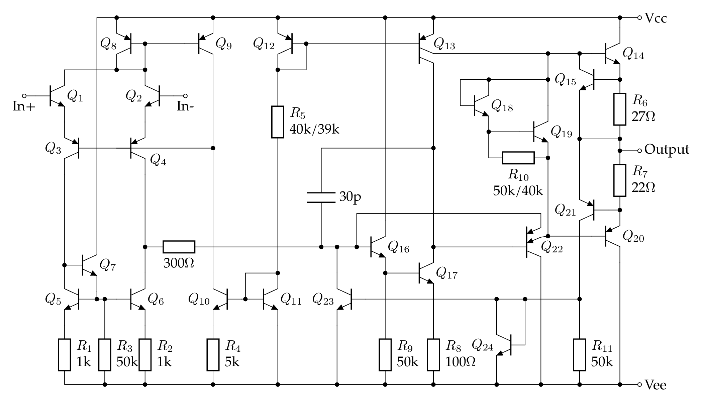
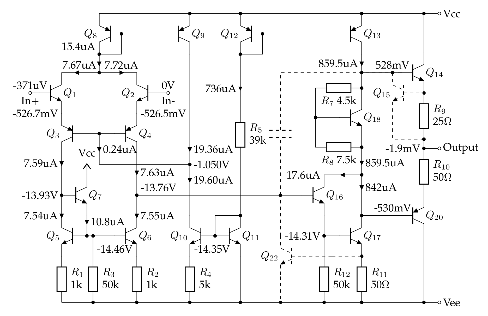
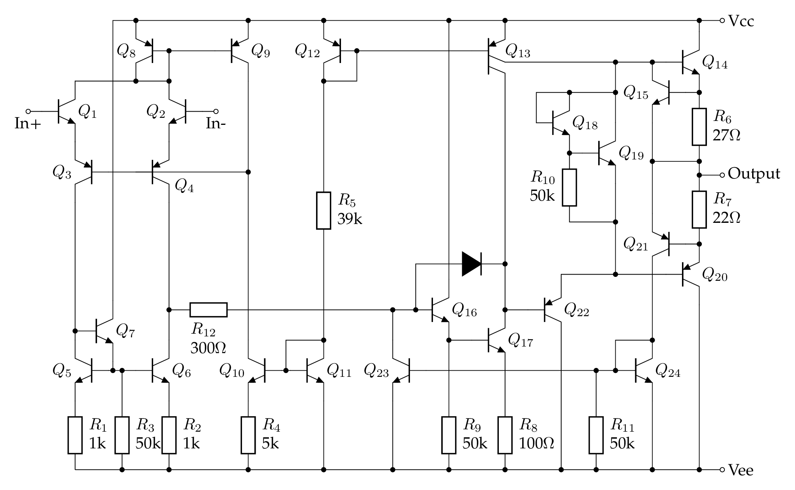

# µA741 笔记

µA741 是第二代集成运算放大器的代表，由 David Fullagar 在 1968 年为 Fairchild 公司设计。常见的兼容型号有 UA741, LM741, KA741 等等。以下简称 741。741 有[历史意义](741/SectionH.pdf)，也有学习的价值，[资料丰富](741/Sedra8e_x5.pdf)，但在 21 世纪的今天没有多少使用价值。

MC1458 / MC1558 是 741 的双运放版本，电路特性是一样的。[1974 年上市](https://www.learningelectronics.net/VA3AVR/gadgets/741/741.html)的 RC4558 是第一款集成双运放，其性能指标和 µA741 相仿，[电路比 741 略微简单一些](741/rc4558.png)。同年晚些时候上市的 LM324 是集成四运放，连同其双运放版 LM358 至今是十分流行的器件，我怀疑 LM358 可能是目前销量最大的运放。

Dave Fullagar and [history of µA741](741/ho18opamp.pdf)

* <https://www.edn.com/voices-dave-fullagar-analog-ic-designer-and-entrepreneur/>
* <https://www.computerhistory.org/collections/catalog/102739975>
* <https://archive.computerhistory.org/resources/text/Oral_History/Fairchild_at_50/102658281.05.01.acc.pdf>
* <https://exhibits.stanford.edu/silicongenesis/catalog/gr517bk2144>
* <https://www.electronicsweekly.com/blogs/engineer-in-wonderland/an-engineer-in-wonderland-inventing-the-555-and-2009-03/>
* <https://www.electronicsweekly.com/blogs/mannerisms/yarns/designing-741-dave-fullagar-2017-02/>

芯片的版图：

* <https://www.righto.com/2015/10/inside-ubiquitous-741-op-amp-circuits.html> 分析的是金封的 AD741
* <https://spectrum.ieee.org/chip-hall-of-fame-fairchild-semiconductor-a741-opamp> 是原始 Fairchild 的硅片，也见 <https://www.computerhistory.org/revolution/digital-logic/12/281/1478>
* <https://www.tinytransistors.net/2020/11/03/the-741-op-amp/> 列出了多个厂家的 die。

其中面积最大的发亮的区域是 30pF 的补偿电容。

## 内部电路

741 内部电路很经典，国内的模电教材上常讲的 F007 运放其实是 µA741 的“山寨版”，“F”字头我猜代表“放”大。741 的内部电路有两个常见的版本，分别有 20 个三极管和 24 个三极管，以下称为 20T 版和 24T 版。

为了简化，两个调零的引脚没有画出来。

20T 版（Wikipedia 以此为例介绍[运算放大器](https://en.wikipedia.org/wiki/Operational_amplifier#Internal_circuitry_of_741-type_op_amp)），重绘自 Fairchild [1970 年数据手册](741/fairchild1970.pdf)：

上图中电阻编号跳过了 R6，三极管跳过了 Q19 和 Q21。所以虽说三极管最大编号是 Q22，其实电路图中一共只有 20 个三极管。这可能说明电路几经修改才呈现现在的样子。

更常见的 24T 版，重绘自 Fairchild [1987 年数据手册](741/fairchild1987.pdf)：

上图中 Q16 基极到 Q6 集电极的 300Ω 电阻没有标号，似乎可以算作 R12。

可以看出输入级是一样的，但中间级和输出级略有不同。从上往下看：

* 20T 版本的 Q13 是普通 PNP，24T 版的 Q13 有两个集电极，通常认为其面积之比为 \(3:1\)，电流是 550μA 和 180μA。
* 20T 版本用来消除交越失真的是 Vbe 倍增电路，也叫 [rubber diode](https://en.wikipedia.org/wiki/Rubber_diode)，用了一个三极管 Q18 和两个电阻 R7/R8。24T 版本是两个三极管 Q18/Q19 和一个电阻 R10。Fairchild 手册上画的 R10 是 50k，Sedra&Smith 书上分析的电路是 40k，我也不知道为啥不一样。
* R5 改成了 40kΩ，但 Sedra&Smith 书上还是按 39kΩ 来计算参考电流。
* Q16 和 Q17 原来是 Darlinton pair，24T 版本把 Q16 的集电极接到 Vcc，等于把 Q16 做成射极跟随器。这样一来，中间级的增益完全由 Q17 提供，因为后面新增 Q22 也是射极跟随器，不提供电压增益。我猜测是 24T 版本的生产工艺进步，单个三极管的 beta 提高，所以可以这么改。
* Q17 的集电极和 Q20 的基极之间增加了一个双发射极的 PNP 管 Q22，是比较少见的画法/用法。Q22 的第一个发射极接 Q20 基极，可以看作射极跟随器 Q22 的输出，是信号通路，比较容易理解；第二个发射极接到 Q16 基极，考虑到 Q16 基极电位只比 Vee 高 2Vbe，那只有在 Q22 基极比 Q16 基极低 1 个 Vbe 以上时，Q22 的第二发射极才会导通。一般认为它的第二个发射极的作用有两个：一是防止 Q16 电流过大而烧毁（因为现在 Q16 的集电极接到 Vcc 去了，原来它的电流受 Q13 限制）；二是防止 Q17 饱和，因为当 Q17 的集电极低于 Q17 的基极时，Q22 的第二发射极导通，Q17 的集电极电压不会进一步降低。有的版本把第二个发射极画成一个二极管（[TI 的 µA741 数据手册](741/ua741-ti.pdf)），有的则干脆省略了第二个发射极（Sedra&Smith 书）。
* 在原来 Q15/Q23 的基础上，新增了 Q21 和 Q24 用作短路保护。Q24 的画法比较奇怪，它其实和 Q23 构成 current mirror，当 Q20 电流过大，Q21 导通，其集电极电流通过 Q24 复制到 Q23，从而将 Q16 基极拉低，以实现保护。

### 一点技术文献考古

* Fairchild [1970 年](741/fairchild1970.pdf) 和 [1971 年](741/fairchild1971.pdf) 的数据手册上画的是 20T 版本
    * 1970 年的标题是 High Performance Operational Amplifier
    * 1971 年改成了 Frequency-compensated Operational Amplifier
    * 从电路图观察，增益级 Q17 和输出管 Q14/Q20 之间的空白似乎太大了，只画了一个限流的 Q15，我的猜测是设计和试生产过程中间有其他改动，最终版只保留了现在看到的几个管子，但是图纸上的空白也留下来了。
    * 1970 年有 µA741 和 µA741C 两种型号，µA741C 是“低配版”，电源电压范围略小、工作温度范围较小、输入失调电压增大；前者只有 [TO-99 金属封装](https://www.computerhistory.org/revolution/digital-logic/12/281/1490)，后者有金属封装和 DIP-14 两种封装，但没有日后更常见的 DIP-8。
    * 为什么 pin8 不是 Vcc 而是悬空？因为上一代的 µA709 (Robert Widlar 设计) 需要外接频率补偿，而它的 pin1 和 pin8 正是干这个的。µA741 内置了频率补偿，但为了和 µA709 管脚兼容，只好把 pin8 悬空了。pin1 和 pin5 改成了调零端。
    * 1971 年把这两个型号合到了一起，就叫 µA741，但是手册上分为两个等级，312 级是宽温度范围，393 级是普通温度范围（和上一年的 µA741C 一样）。
* Fairchild [1973 年](741/fairchild1973.pdf) 数据手册最有意思，它同时有 20T 版本的 µA741/µA741C，又有 24T 版本的 µA741A/µA741E。
    * 出现了日后常用的 DIP-8 封装，这或许解释了为什么 DIP-8 的管脚排列初看上去比较别扭，是为了和 TO-99 金封的管脚兼容。金属封装的管脚排列就比较自然，因为它是圆形的，旋转对称。
    * µA741A 各方面的性能比原始 µA741 略有提高，比如失调电压、失调电流、偏置电流都都有所减小。我推测，Fairchild 1973 年改进了生产工艺，提高了集成电路中三极管的性能，顺便微调了 µA741 的电路图和版图，顺势推出了 24T 版的 µA741A。为了照顾现有客户，还继续生产旧的 20T 版 µA741。
    * [National LM741](741/LM741-NS.pdf) 列出了 741A/741/741C 的性能对比。注意到输入偏置电流的典型值从 80nA 减小为 30nA，我们[计算得知](741/Sedra8e_x5.pdf) 741 输入级的集电极电流约为 9.5μA，据此可以推测旧版的输入级差分 NPN 对管 Q1/Q2 的 \(\beta = 9.5 / 0.08 \approx 120\)，新版的 \(\beta = 9.5/0.03\approx 317\)。
    * 输入失调电流的典型值从 20nA 大幅降低为 3nA，可能得益于 PNP 管的性能提升。文献上提到，旧版的横向 PNP 管的 \(\beta\) 只有不到 10，一般以 5 计算；而新版的估计能有 50.
* Fairchild [1979 年](741/fairchild1979.pdf) 和 [1987 年](741/fairchild1987.pdf) 的数据手册上画的 µA741 是 24T 版本，说明旧的 20T 版已经淘汰。
* National [1971 年](741/national1971.pdf)数据手册上的 LM741 是 20T 版本，原理图漏标了 Q18。直到现在[TI LM741 的手册](741/LM741-TI.pdf)也是 20T 版本，也还是漏标了 Q18。从 [1988 年](741/national1988.pdf)起，原理图把 Q15 标重复了，这个错误一直保留到了现在 TI 的 [LM741 datasheet](741/LM741-TI.pdf) 第 7 页。我估计是重画这个电路的实习生把 Q17 肩膀上的 Q16 看成了 Q15。
* TI [1984 年技术手册](741/ti1984.pdf)上的 µA741 是独有的 22T 设计，但是这个手册少画了 Q16 基极的输入信号（应该接到 Q4 的集电极），[TI 现在的手册](741/ua741-ti.pdf)是正确的。换言之，由于收购 National 的关系，TI 现在的产品线既有国半的 20T 版 LM741 又有自己独特的 22T 版 µA741。

Ken Shirrif 曾说，他问过发明人 Dave Fullagar 为何有两个版本的 741，得到的回复是 Fairchild 原始设计的芯片版图就有两个版本，具体原因他也不记得了。

>  I talked with Dave Fullagar, the inventor of the 741, and it turns out that these two different designs go back to the original Fairchild dies, and he's not sure why there are the two designs.

Dave Fullagar 1969 年离开 Fairchild 加盟 Intersil，所以我猜测 24T 版的改动是他在 Fairchild 的前同事们做的，他并不知情。

## 分析与仿真

分立器件 XL741 笔记 ： <http://chenshuo.github.io/notes/XL741/>

20T 版的直流工作点仿真结果，用于短路保护的 Q15 和 Q22 处于关断状态，用虚线表示：

### 直流工作点计算

假设所有三极管 \(I_\mathrm{S} = 10\)fA，除输出推挽管 Q14/Q20 外，面积均相等。假设 \(\beta \gg 1\)，忽略基极电流，\(I_\mathrm{C}\approx I_\mathrm{E}\)：

* 假设 Vbe = 0.65V，\(I_\mathrm{REF} = I_\mathrm{R5} = \dfrac{30-0.65\times 2}{39\mathrm{k}}\approx 0.736 \mathrm{mA}\)。Q12/Q13 是电流镜 \(I_\mathrm{C11} \approx I_\mathrm{C12} \approx I_\mathrm{C13} \approx I_\mathrm{REF} = 0.736 \mathrm{mA}\)

* Widlar 电流源 Q10/Q11，\(I_\mathrm{C10} R_4 = V_\mathrm{T}\ln \dfrac{I_\mathrm{REF}}{I_\mathrm{C10}}\)，这是个超越方程，用数值方法求出 \(I_\mathrm{C10} \approx 18.9\)µA，Sedra&Smith 取 19µA。
* Q8/Q9 是电流镜（其实要算上 Q3/Q4 的负反馈，可看作 Wilson 电流源），所以 \(I_\mathrm{C8} = I_\mathrm{C9} = I_\mathrm{C10} = 18.9\)µA
* Q5/Q6 也是电流镜，所以 Q1 和 Q2 平分 \(I_\mathrm{C8}\)，\(I_\mathrm{C1} = I_\mathrm{C2} = I_\mathrm{C3} = I_\mathrm{C4} = I_\mathrm{C5} = I_\mathrm{C6} = \dfrac{I_\mathrm{C8}}{2}\approx 9.5\)µA
* 现在来算 Q7 的电流 \(I_\mathrm{C7}\)。假设 \(I_\mathrm{S} = 10\)fA，由于 \(I_\mathrm{C5}=9.5\)µA，算得 \(V_\mathrm{BE5} = V_\mathrm{T} \ln\dfrac{I_\mathrm{C5}}{I_\mathrm{S}} \approx 25.8  \ln (9.5\times 10^{8}) \approx 533.3\)mV，Q5 基极（Q7 发射极）到 Vee 的电压是 \(V_\mathrm{B5} - V_\mathrm{EE} = V_\mathrm{BE5} + I_\mathrm{C5}\,R_1 = 533.3 + 9.5 = 542.8\)mV。 \(I_\mathrm{C7}\approx  I_\mathrm{E7} \approx \dfrac{542.8\mathrm{mV}}{R_3} = 10.86\)µA

至此，Q1 ~ Q13 的偏置电流全部算出来了，这部分的计算和 24T 版是完全一样的。

以下中间增益级的计算和 24T 有所不同。

* Q16 和 Q17 做成 Darlinton pair，如果忽略 Q14 和 Q20 的基极电流，考虑 Q12/Q13 电流镜，则 \(I_\mathrm{C16} + I_\mathrm{C17} \approx I_\mathrm{REF} = 0.736\)mA

* Q16 的发射极电流会进入 R12 和 Q17 的基极 \( I_\mathrm{R12} + I_\mathrm{B17} = I_\mathrm{E16} \approx I_\mathrm{C16}\)

* Q17 的基极到 Vee 的电压（即 R12 上的电压）为 \(V_\mathrm{B17} - V_\mathrm{EE} = V_\mathrm{BE7} + I_\mathrm{E17}\,R_{11}\)

* R12 上的电流 \(I_\mathrm{R12} = \dfrac{V_\mathrm{B17} - V_\mathrm{EE}}{R_{12}}\)

联立以上几个条件：

\(I_\mathrm{C16} + I_\mathrm{C17} = 0.736\)

\(I_\mathrm{R12} + I_\mathrm{C17} / \beta = I_\mathrm{C16}\)

\(I_\mathrm{R12}\,R_{12} =  V_\mathrm{BE7} +\dfrac{\beta+1}{\beta} I_\mathrm{C17}\,R_{11}\)

假设 \(\beta=200\)，考虑到大部分偏置电流会经过 Q17，假设 \(V_\mathrm{BE7}=0.65\)V，解线性方程组得

* \(I_\mathrm{R12} = 13.7\)µA
* \(I_\mathrm{E17} = 736 - 13.7 = 722.3\)µA
* \(I_\mathrm{B17} = I_\mathrm{E17} / (\beta+1) = 3.6\)µA
* \(I_\mathrm{C16} \approx I_\mathrm{E16} = 13.7+3.6 = 17.3\)µA

输出级，一般认为 Q14 和 Q20 的面积是普通管子的 3 倍：

* 近似认为 Q18 的电流是 \(I_\mathrm{REF} = 0.736\)mA，则 \(V_\mathrm{BE18}\approx 0.65\)V，考虑 Q18 的 Vbe 倍增效果，\(V_\mathrm{CE18}\approx (1+\dfrac{R_7}{R_8}) V_\mathrm{BE18} = 1.6 \times 0.65 = 1.04\)V
* 当输出为 0V 时，\(I_\mathrm{E14} = I_\mathrm{E20}\)，所以认为 \(V_\mathrm{BE14}\) 和 \(V_\mathrm{BE20}\) 平分 \(V_\mathrm{CE18}\)，即  \(V_\mathrm{BE14} =  V_\mathrm{BE20} = V_\mathrm{CE18}/2 = 0.52\)V

* Q14 和 Q20 的静态偏置电流为 \(3 I_\mathrm{S}\exp\dfrac{V_\mathrm{BE14}}{V_\mathrm{T}} = 10\times 10 ^{-15} \exp\dfrac{0.52}{0.0258}\approx 17\)µA

至此，全部管子的直流工作点已经求出来。

| 三极管 | \(I_\mathrm{C}\) (µA)| 仿真结果 (µA)|
| --- | --- | --- |
| Q11/Q12 | 736   | 736 |
| Q13     | 736   | 859.5 |
| Q10/Q9  | 18.9  | ~19.5 |
| Q8      | 18.9  | 15.4 |
| Q1 ~ Q6 | 9.5   | ~7.6 |
| Q7      | 10.86 |  10.8 |
| Q16     | 17.3  | 17.6 |
| Q17     | 722.3 | 842  |
| Q18     | Vce = 1.04V | Vce = 1.058V |
| Q14/Q20     | 17    | ~27 |

据我分析，误差主要来自 PNP 管 Early 电压只有 50V。在手工计算中，我们忽略了 Early 效应，如果加上这一因素，计算结果会更接近仿真结果。例子可参考[分立器件 XL741 笔记](http://chenshuo.github.io/notes/XL741/#summary)。

### 24T 版

以下讨论 24T 版。

为了便于分析，现将 24T 版电路图重绘于下，暂时略去补偿电容：

上图把 Q22 画成普通 PNP 管，把它的第二发射极画成一个二极管。Q24 画成镜像电流源常见的形式，R5 取 39k，和手册略有不同，但和 XL741 和 Sedra&Smith 书一致。

Q1 ~ Q12 的偏置电流的计算方法和 20T 版完全一样，此处不再重复，而直接列出结果。
假设 \(\beta \gg 1\)，忽略基极电流，\(I_\mathrm{C}\approx I_\mathrm{E}\)：

| 三极管 | \(I_\mathrm{C}\) (µA)| 计算方法 |
| --- | --- | --- |
| Q11/Q12 | 736 | \(I_\mathrm{REF}=\dfrac{30-2\times 0.65}{39\mathrm{k}}\) |
| Q10/Q9/Q8 | 18.9 | \(I_\mathrm{C10} R_4 = V_\mathrm{T}\ln \dfrac{I_\mathrm{REF}}{I_\mathrm{C10}}\) |
|Q1 ~ Q6 | 9.5 | \(I_\mathrm{C1} = I_\mathrm{C10} / 2\) |
| Q7 | 10.86 | \(I_\mathrm{E7} \approx \dfrac{V_\mathrm{B5} - V_\mathrm{EE}}{R_3}\) |

中间级，假设 \(\beta=200\)：

* Q17 集电极接 Q13B 的集电极，电流为 \(I_\mathrm{C17} = \dfrac{3}{4}I_\mathrm{REF} = 552\)µA.

* \(V_\mathrm{BE17} = V_\mathrm{T}\ln\dfrac{I_\mathrm{E17}}{I_\mathrm{S}}=25.8\times \ln \dfrac{552\times 10^{-6} }{ 10^{-14}} = 638\) mV,

* R9 两端的电压 \(V_\mathrm{B17} - V_\mathrm{EE}= V_\mathrm{BE17} + I_\mathrm{E17}\,R_8 = 694\)mV

* Q16 的发射极电流 \(I_\mathrm{E16} = I_\mathrm{B17} + I_\mathrm{R9} =\dfrac{I_\mathrm{C17}}{\beta} + \dfrac{V_\mathrm{B17} - V_\mathrm{EE}}{R_9} = 16.6\)µA

一般的算法是先估算 \(V_\mathrm{CE19}\) 以确定 Q14 和 Q20 的偏置电压。

* \(V_\mathrm{CE19}=V_\mathrm{BE18} + V_\mathrm{BE19}\)
* \(I_\mathrm{R10}\,R_\mathrm{10} = V_\mathrm{BE19}\)
* \(I_\mathrm{E18} = I_\mathrm{R10} + I_\mathrm{B19}\)

也可以先估算 Q18 和 Q19 的电流，再用 translinear 电路的分析方法求 Q14 和 Q20 的电流。

输出级，一般认为 Q14 和 Q20 的面积是普通管子的 3 倍。

待续。。。
