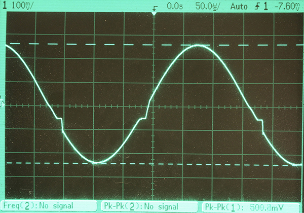
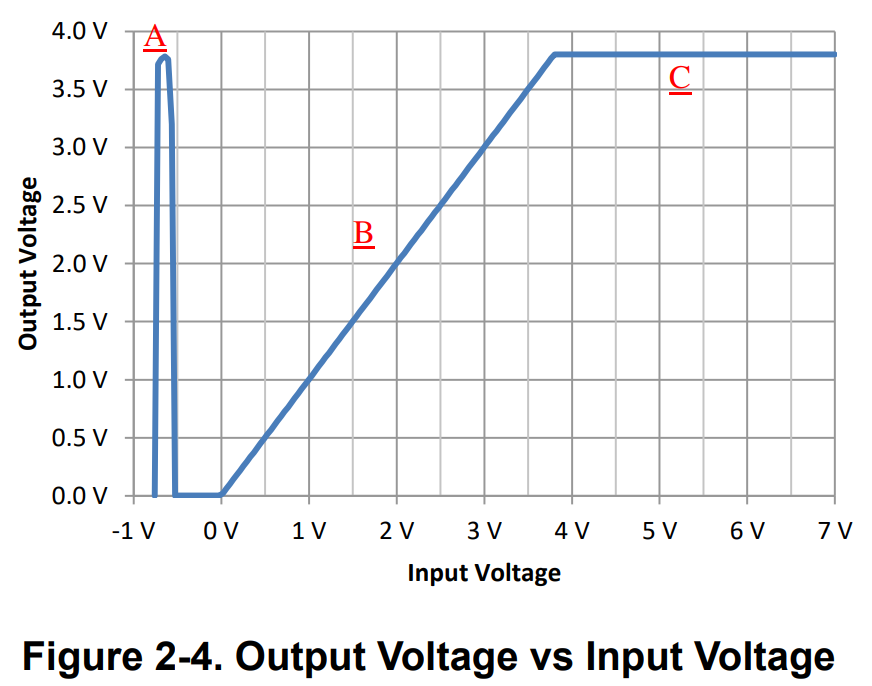
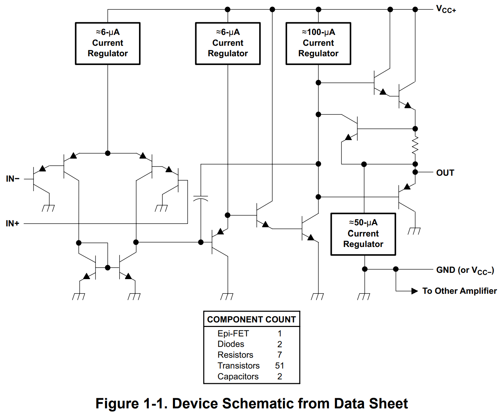

<h1>常用器件数据手册</h1>

## 运放与比较器

EEVBlog 1436 - [The TOP 5 Jellybean OPAMP's](https://www.youtube.com/watch?v=uq1DMWtjL2U&ab_channel=EEVblog)

| 型号 | 输入 | 特点 |
| --- | --- | --- |
| LM358/324 | BJT | 廉价、通用、单电源、低功耗 |
| TL072/074 | JFET | 高速 (3 MHz, 13V/µs) |
| LMV358 | CMOS | Rail-to-rail 输出、低压 (5.5V) |
| MCP6292 | CMOS | 高速 (10 MHz)、Rail-to-rail、低压 (5.5V) |
| OP07 | BJT | 精密、低失调 |
| LM4562/LME49720 | BJT | Hi-Fi、低噪音、低失真 |

不推荐： [µA741/LM741](741.md)，已经被淘汰，与上面几款相比没有任何优势。
741 有历史意义，也有学习的价值，资料丰富，但没有多少使用价值。

* 运放电路集锦 [AN-31: Op Amp Circuit Collection](https://web.ece.ucsb.edu/Faculty/rodwell/Classes/ece2c/resources/an-31.pdf) 国半 1978, [TI 最新版](https://www.ti.com/lit/an/snla140d/snla140d.pdf)
* LM358/LM324 可能是目前最常用的通用运放。
    * LM358 是双运放，LM324 是四运放，后者的[器件手册](https://www.ti.com/lit/ds/symlink/lm2902-n.pdf)有非常多的电路示例。
    * LM358/LM324 可以单电源供电，输入输出都可以到 GND。
    * 注意它为了实现低功耗（按当时的标准），输出极采用的是乙类放大，放大交流信号会有交越失真。消除办法之一是把负载电阻从接地改成接电源负极，从而迫使输出极工作在甲类状态，代价则是输出电流增加，功耗加大。 

     

    * 注意它的共模输入范围，如果输入电压比负电源低 0.3V 以上，会出现相位反转 phase reversal。如下图中的 A 区，输入比电源负极低 0.5V，输出电压从 0 跳变成接近正电源电压。设计电路的时候需要注意防止出现这种意外情况，参考 [Application Design Guidelines for LM324 and LM358 Devices](https://www.ti.com/lit/an/sloa277b/sloa277b.pdf)

    
    
    * 器件手册上给的内部简化电路图只有十几个三极管，看上去比 741 还简单，但实际上它有五十几个晶体管，远比早期运放复杂。我在 onsemi 的手册上找到一份[详细的电路图](https://www.onsemi.com/download/data-sheet/pdf/lm358-d.pdf)。目前我能找到的 SPICE 仿真模型也都是行为仿真，而不是三极管级别的仿真。有的模型会加入固定的 2mV 输入失调电压，有的则没有。而且不是每个模型都能复现上面提到的交越失真和相位反转这两个常见 bug。

关于器件型号的前缀。

* 仙童公司(Fairchild，2016 年被 onsemi 收购)的器件常以 µA 开头，[据说](https://www.quora.com/What-is-the-difference-between-LM741-and-UA741/answer/Larry-Zuckerman-2)是 micro amplifier 的缩写。
* 美国国家半导体(“国半/National”，2011 被 TI 收购)的器件型号常以 LM 开头，据前面同一个人说是 Linear Microchip 的缩写，另外一种说法是 Linear Monolithic 的缩写。
* 德州仪器 (TI) 的器件常以 TL 开头，我推测是 TI Linear 的缩写，例如 TL082、TL431、TL494 等等。

<h2>比较器</h2>

一般不建议直接拿运放当电压比较器，而应该使用专门的器件。

EEVblog 1464 - [TOP 5 Jellybean Comparators](https://www.youtube.com/watch?v=c5M8P6oe9xY&ab_channel=EEVblog)

| 型号 | 特点 |
| --- | --- |
| LM393 | Dual |
| LM339 | Quad |
| LMV331/393/339 | 低压 (5.5V) |

## 三端稳压与电压基准

关于 LM7805、TL431 等的笔记 [稳压与基准](regulator.md)

EEVblog 1438 - [The TOP 5 Jellybean Regulators & References](https://www.youtube.com/watch?v=YHRxvUqy3Uw&ab_channel=EEVblog)

| 型号 | 特点 |
| --- | --- |
| LM78xx/79xx | 固定三端稳压 |
| LM317/337 | 可调三端稳压 |
| TLV1117 | LDO, 固定 3.3V, 2.5V, 1.8V, 以及可调版 |

LM7805 是（最）流行的三端稳压集成电路，非常好用、耐用。

* [The Art of Electronics 3/e](https://artofelectronics.net/) 第 9 章 [稳压电源](https://artofelectronics.net/wp-content/uploads/2016/02/AoE3_chapter9.pdf)
* <https://www.righto.com/2014/09/reverse-engineering-counterfeit-7805.html> 有其内部电路原理（包括 [bandgap](https://en.wikipedia.org/wiki/Bandgap_voltage_reference) [reference](https://circuitcellar.com/resources/quickbits/bandgap-voltage-reference/)）的精彩介绍。国内模电教材有的会讲 W7800 的内部电路，是早期 µA7805 的翻版。“W”字头我猜代表的是“稳”压。
* LM317 现在的 datasheet 上只有原理框图，在旧的 datasheet 上有详细的电路图。

<h2>电压基准</h2>

| 型号 | 特点 |
| --- | --- |
| TL431 | 通用可调电压基准，自带基准电压的比较器 |
| LM4040/4041 | 精密固定电压 2.048V, 4.096V 等，以及可调版 |
| LM336 | 固定 2.5V / 5.0V |
| LM385 | 固定 1.2V / 2.5V / 可调|
| LM399 | 恒温、精密 |
| LM334 | 恒流、温度传感器 |
| REF34 / REF50 | 精密、小体积 |
| AD580 / AD581 | 早期经典 |
| LTZ1000 / ADR1000 | 神器 |

TL431 用途非常广泛

* <https://en.wikipedia.org/wiki/TL431>
* <https://www.righto.com/2014/05/reverse-engineering-tl431-most-common.html>
* Eugene Dvoskin 发布的 [TL431 SPICE 仿真模型](https://www.audio-perfection.com/voltage-regulators/linear-regulators/accurate-tl431-model-development-analysis-and-evaluation/)
* onsemi 的 [Christophe Basso](http://powersimtof.com/Spice.htm) 写的讲义
 [The TL431 in the Control of Switching Power Supplies](https://www.onsemi.com/pub/Collateral/TND381-D.PDF)

LM385 <http://www.righto.com/2022/04/reverse-engineering-lm185-voltage.html>

## 晶体管（BJT、FET）

* EEVblog 1599 - [TOP 5 Jellybean Bipolar Transistors](https://www.youtube.com/watch?v=XYdmX8w8xwI&ab_channel=EEVblog)
* [Jellybean components](https://theknowledgeaccelerator.com/2016/04/16/jellybean-components/#Transistors)
* https://www.eevblog.com/forum/beginners/jellybean-hobbyist-general-purpose-transistors/
* https://en.wikipedia.org/wiki/2N2222

| 型号 | Vce | Ic | \(P_\mathrm{D}\) | \(f_\mathrm{T}\) |特点 |
| --- | --- | --- | --- | --- | --- |
| 2N3904/3906 | 40V | 200mA | 625mW | 250MHz | 小功率 |
| PN2222/2907 | 30V | 600mA | 625mW | 250MHz | 中小功率 |
| SS8050/8550 | 25V | 1.0A  | 1W    | 100MHz | 中功率 |
| MJE3055/2955 | 60V | 10A | 75W | 2MHz | 大功率 |
| TIP41/42   | 100V | 6A  | 65W  | 3MHz | 大功率 |
| TIP142/147 | 100V | 10A | 125W | ?    | 达林顿 |
