<h1>全国大学生电子设计竞赛 历届试题</h1>

首届全国大学生电子设计竞赛举办于 1994 年，此后逢奇数年举办，截至 2023 年已成功举办了 16 届。

这是历届的试题，可直接下载，也可以直接 `$ git clone ` <https://github.com/chenshuo/nuedc>

从 1999 年起，通常每届比赛颁奖的次年会出版“获奖作品选编”书籍，但是我没有找到
2019 年第十四届的相应书籍，请知晓缘由的人士不吝赐教： chenshuo_AT_chenshuo.com

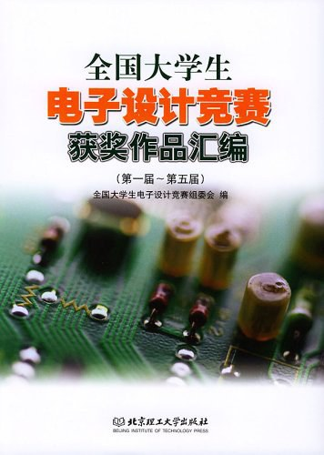

## 1994 年第一届

* [1994 A题 简易数控直流电源](problems/1994_A题_简易数控直流电源.pdf)
* [1994 B题 多路数据采集系统](problems/1994_B题_多路数据采集系统.pdf)

## 1995 年第二届

* [1995 A题 实用低频功率放大器](problems/1995_A题_实用低频功率放大器.pdf)
* [1995 B题 实用信号源的设计和制作](problems/1995_B题_实用信号源的设计和制作.pdf)
* [1995 C题 简易无线电遥控系统](problems/1995_C题_简易无线电遥控系统.pdf)
* [1995 D题 简易电阻、电容和电感测试仪](problems/1995_D题_简易电阻_电容和电感测试仪.pdf)

## 1997 年第三届

* [1997 A题 直流稳定电源](problems/1997_A题_直流稳定电源.pdf)
* [1997 B题 简易数字频率计](problems/1997_B题_简易数字频率计.pdf)
* [1997 C题 水温控制系统](problems/1997_C题_水温控制系统.pdf)
* [1997 D题 调幅广播收音机](problems/1997_D题_调幅广播收音机.pdf)

## 1999 年第四届

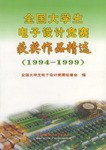

* [1999 A题 测量放大器](problems/1999_A题_测量放大器.pdf)
* [1999 B题 数字式工频有效值多用表](problems/1999_B题_数字式工频有效值多用表.pdf)
* [1999 C题 频率特性测试仪](problems/1999_C题_频率特性测试仪.pdf)
* [1999 D题 短波调频接收机](problems/1999_D题_短波调频接收机.pdf)
* [1999 E题 数字化语音存储](problems/1999_E题_数字化语音存储与回放系统.pdf)

## 2001 年第五届

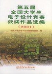

* [2001 A题 波形发生器](problems/2001_A题_波形发生器.pdf)
* [2001 B题 简易数字存储示波器](problems/2001_B题_简易数字存储示波器.pdf)
* [2001 C题 自动往返电动小汽车](problems/2001_C题_自动往返电动小汽车.pdf)
* [2001 D题 高效率音频功率放大器](problems/2001_D题_高效率音频功率放大器.pdf)
* [2001 E题 数据采集与传输系统](problems/2001_E题_数据采集与传输系统.pdf)
* [2001 F题 调频收音机](problems/2001_F题_调频收音机.pdf)

## 2003 年第六届

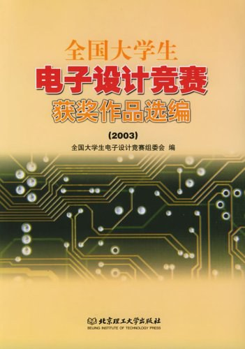

* [2003 A题 电压控制LC振荡器](problems/2003_A题_电压控制LC振荡器.pdf)
* [2003 B题 宽带放大器](problems/2003_B题_宽带放大器.pdf)
* [2003 C题 低频数字式相位测量仪](problems/2003_C题_低频数字式相位测量仪.pdf)
* [2003 D题 简易逻辑分析仪](problems/2003_D题_简易逻辑分析仪.pdf)
* [2003 E题 简易智能电动车](problems/2003_E题_简易智能电动车.pdf)
* [2003 F题 液体点滴速度监控装置](problems/2003_F题_液体点滴速度监控装置.pdf)

## 2005 年第七届

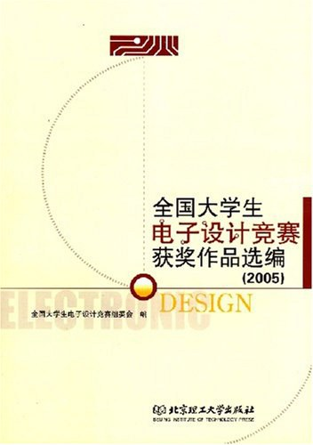

* [2005 A题 正弦信号发生器](problems/2005_A题_正弦信号发生器.pdf)
* [2005 B题 集成运放参数测试仪](problems/2005_B题_集成运放参数测试仪.pdf)
* [2005 C题 简易频谱分析仪](problems/2005_C题_简易频谱分析仪.pdf)
* [2005 D题 单工无线呼叫系统](problems/2005_D题_单工无线呼叫系统.pdf)
* [2005 E题 悬挂运动控制系统](problems/2005_E题_悬挂运动控制系统.pdf)
* [2005 F题 数控直流电流源](problems/2005_F题_数控直流电流源.pdf)
* [2005 G题 三相正弦波变频电源](problems/2005_G题_三相正弦波变频电源.pdf)

## 2007 年第八届

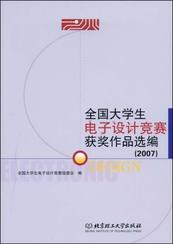

* [2007 A题 音频信号分析仪](problems/2007_A题_音频信号分析仪.pdf)
* [2007 B题 无线识别装置](problems/2007_B题_无线识别装置.pdf)
* [2007 C题 数字示波器](problems/2007_C题_数字示波器.pdf)
* [2007 D题 程控滤波器](problems/2007_D题_程控滤波器.pdf)
* [2007 E题 开关稳压电源](problems/2007_E题_开关稳压电源.pdf)
* [2007 F题 电动车跷跷板](problems/2007_F题_电动车跷跷板.pdf)
* [2007 G题 积分式直流数字电压表](problems/2007_G题_积分式直流数字电压表.pdf)
* [2007 H题 信号发生器](problems/2007_H题_信号发生器.pdf)
* [2007 I题 可控放大器](problems/2007_I题_可控放大器.pdf)
* [2007 J题 电动车跷跷板](problems/2007_J题_电动车跷跷板.pdf)

## 2009 年第九届

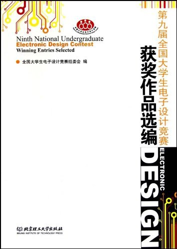

* [2009 A题 光伏并网发电模拟装置](problems/2009_A题_光伏并网发电模拟装置.pdf)
* [2009 B题 声音导引系统](problems/2009_B题_声音导引系统.pdf)
* [2009 C题 宽带直流放大器](problems/2009_C题_宽带直流放大器.pdf)
* [2009 D题 无线环境监测模拟装置](problems/2009_D题_无线环境监测模拟装置.pdf)
* [2009 E题 电能收集充电器](problems/2009_E题_电能收集充电器.pdf)
* [2009 F题 数字幅频均衡功率放大器](problems/2009_F题_数字幅频均衡功率放大器.pdf)
* [2009 G题 低频功率放大器](problems/2009_G题_低频功率放大器.pdf)
* [2009 H题 LED点阵书写显示屏](problems/2009_H题_LED点阵书写显示屏.pdf)
* [2009 I题 模拟路灯控制系统](problems/2009_I题_模拟路灯控制系统.pdf)

## 2011 年第十届

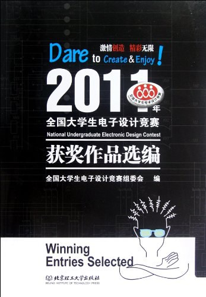

* [2011 A题 开关电源模块并联供电系统](problems/2011_A题_开关电源模块并联供电系统.pdf)
* [2011 B题 基于自由摆的平板控制系统](problems/2011_B题_基于自由摆的平板控制系统.pdf)
* [2011 C题 智能小车](problems/2011_C题_智能小车.pdf)
* [2011 D题 LC谐振放大器](problems/2011_D题_LC谐振放大器.pdf)
* [2011 E题 简易数字信号传输性能分析仪](problems/2011_E题_简易数字信号传输性能分析仪.pdf)
* [2011 F题 帆板控制系统](problems/2011_F题_帆板控制系统.pdf)
* [2011 G题 简易自动电阻测试仪](problems/2011_G题_简易自动电阻测试仪.pdf)
* [2011 H题 波形采集_存储与回放系统](problems/2011_H题_波形采集_存储与回放系统.pdf)

## 2013 年第十一届

本届获奖作品选编分本科组和高职高专组分别出版。

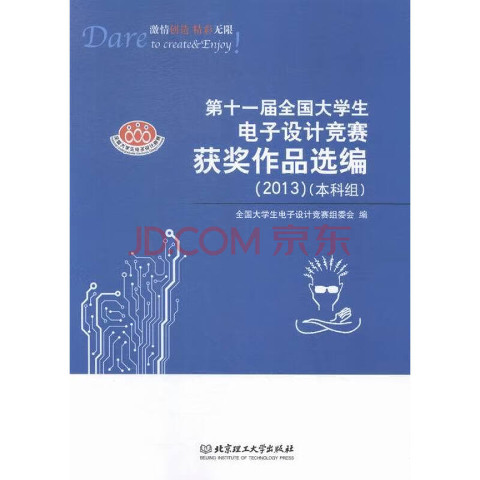
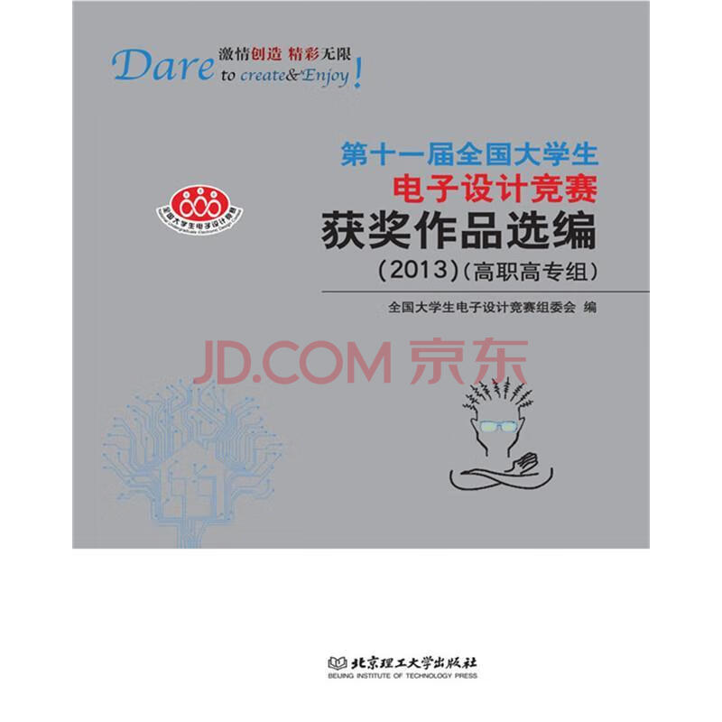

* [2013 A题 单相AC-DC变换电路](problems/2013_A题_单相AC-DC变换电路.pdf)
* [2013 B题 四旋翼自主飞行器](problems/2013_B题_四旋翼自主飞行器.pdf)
* [2013 C题 简易旋转倒立摆及控制装置](problems/2013_C题_简易旋转倒立摆及控制装置.pdf)
* [2013 D题 射频宽带放大器](problems/2013_D题_射频宽带放大器.pdf)
* [2013 E题 简易频率特性测试仪](problems/2013_E题_简易频率特性测试仪.pdf)
* [2013 F题 红外光通信装置](problems/2013_F题_红外光通信装置.pdf)
* [2013 G题 手写绘图板](problems/2013_G题_手写绘图板.pdf)
* [2013 J题 电磁控制运动装置](problems/2013_J题_电磁控制运动装置.pdf)
* [2013 K题 易照明线路探测仪](problems/2013_K题_易照明线路探测仪.pdf)
* [2013 L题 直流稳压电源及漏电保护装置](problems/2013_L题_直流稳压电源及漏电保护装置.pdf)

## 2015 年第十二届

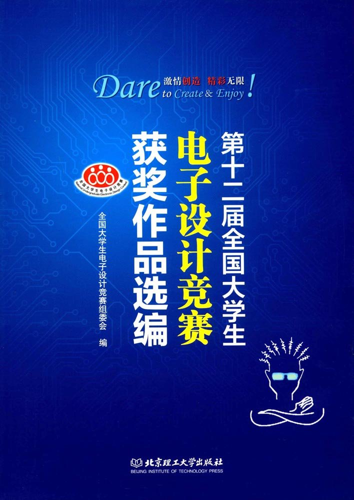

* [2015 A题 双向DC-DC变换器](problems/2015_A题_双向DC-DC变换器.pdf)
* [2015 B题 风力摆控制系统](problems/2015_B题_风力摆控制系统.pdf)
* [2015 C题 多旋翼自主飞行器](problems/2015_C题_多旋翼自主飞行器.pdf)
* [2015 D题 增益可控射频放大器](problems/2015_D题_增益可控射频放大器.pdf)
* [2015 E题 80MHz-100MHz频谱仪](problems/2015_E题_80MHz-100MHz频谱仪.pdf)
* [2015 F题 数字频率计](problems/2015_F题_数字频率计.pdf)
* [2015 G题 短距视频信号无线通信网络](problems/2015_G题_短距视频信号无线通信网络.pdf)
* [2015 H题 LED闪光灯电源](problems/2015_H题_LED闪光灯电源.pdf)
* [2015 I题 风板控制装置](problems/2015_I题_风板控制装置.pdf)
* [2015 J题 小球滚动控制系统](problems/2015_J题_小球滚动控制系统.pdf)

## 2017 年第十三届

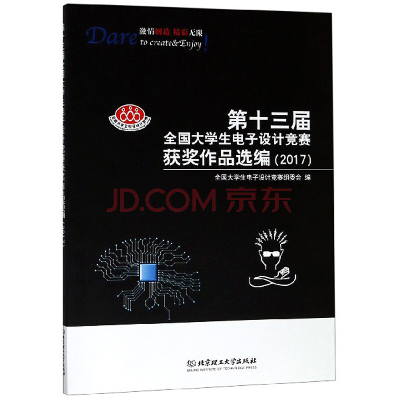
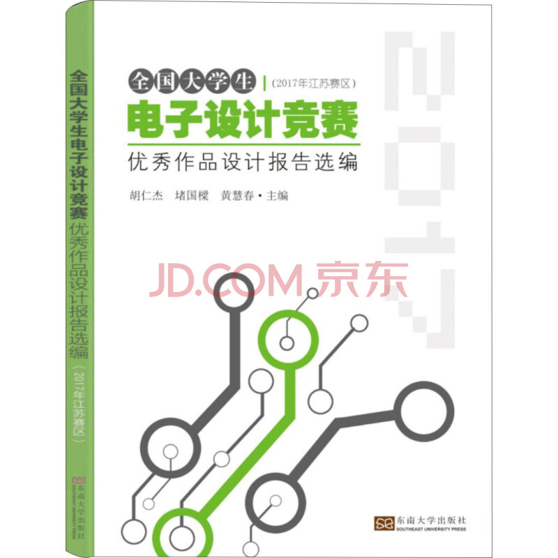

* [2017 A题 微电网模拟系统](problems/2017_A题_微电网模拟系统.pdf)
* [2017 B题 滚球控制系统](problems/2017_B题_滚球控制系统.pdf)
* [2017 C题 四旋翼自主飞行器探测跟踪系统](problems/2017_C题_四旋翼自主飞行器探测跟踪系统.pdf)
* [2017 E题 自适应滤波器](problems/2017_E题_自适应滤波器.pdf)
* [2017 F题 调幅信号处理实验电路](problems/2017_F题_调幅信号处理实验电路.pdf)
* [2017 H题 远程幅频特性测试装置](problems/2017_H题_远程幅频特性测试装置.pdf)
* [2017 I题 可见光室内定位装置](problems/2017_I题_可见光室内定位装置.pdf)
* [2017 K题 单相用电器分析监测装置](problems/2017_K题_单相用电器分析监测装置.pdf)
* [2017 L题 自动泊车系统](problems/2017_L题_自动泊车系统.pdf)
* [2017 M题 管道内钢珠运动测量装置](problems/2017_M题_管道内钢珠运动测量装置.pdf)
* [2017 O题 直流电动机测速装置](problems/2017_O题_直流电动机测速装置.pdf)
* [2017 P题 简易水情检测系统](problems/2017_P题_简易水情检测系统.pdf)

## 2019 年第十四届

我没有找到本届竞赛的获奖作品选编，请知晓缘由的人士不吝赐教： chenshuo_AT_chenshuo.com

* [2019 A题 电动小车动态无线充电系统](problems/2019_A题_电动小车动态无线充电系统.pdf)
* [2019 B题 巡线机器人](problems/2019_B题_巡线机器人.pdf) 附图
  [场地铺设](problems/2019_B题_巡线机器人_附图_场地铺设.jpg) 和
  [悬停同心圆](problems/2019_B题_巡线机器人_附图_悬停同心圆.jpg)
* [2019 C题 线路负载及故障检测装置](problems/2019_C题_线路负载及故障检测装置.pdf)
* [2019 D题 简易电路特性测试仪](problems/2019_D题_简易电路特性测试仪.pdf)
* [2019 E题 基于互联网的信号传输系统](problems/2019_E题_基于互联网的信号传输系统.pdf)
* [2019 F题 纸张计数显示装置](problems/2019_F题_纸张计数显示装置.pdf)
* [2019 G题 双路语音同传的无线收发系统](problems/2019_G题_双路语音同传的无线收发系统.pdf)
* [2019 H题 模拟电磁曲射炮](problems/2019_H题_模拟电磁曲射炮.pdf)
* [2019 I题 LED线阵显示装置](problems/2019_I题_LED线阵显示装置.pdf)
* [2019 J题 模拟电磁曲射炮](problems/2019_J题_模拟电磁曲射炮.pdf)
* [2019 K题 简易多功能液体容器](problems/2019_K题_简易多功能液体容器.pdf)

## 2021 年第十五届

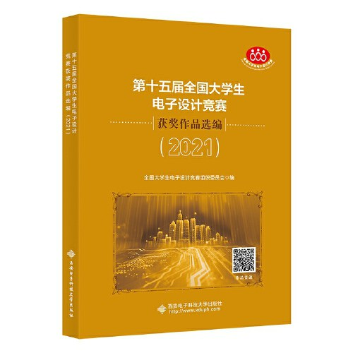

* [2021 A题 信号失真度测量装置](problems/2021_A题_信号失真度测量装置.pdf)
* [2021 B题 三相AC-DC变换电路](problems/2021_B题_三相AC-DC变换电路.pdf)
* [2021 C题 三端口DC-DC变换器](problems/2021_C题_三端口DC-DC变换器.pdf)
* [2021 D题 基于互联网的摄像测量系统](problems/2021_D题_基于互联网的摄像测量系统.pdf)
* [2021 E题 数字-模拟信号混合传输收发机](problems/2021_E题_数字-模拟信号混合传输收发机.pdf)
* [2021 F题 智能送药小车](problems/2021_F题_智能送药小车.pdf) 和 [数字字模](problems/2021_F题_智能送药小车数字字模.pdf)
* [2021 G题 植保飞行器](problems/2021_G题_植保飞行器.pdf)
* [2021 H题 用电器分析识别装置](problems/2021_H题_用电器分析识别装置.pdf)
* [2021 I题 具有发电功能的储能小车](problems/2021_I题_具有发电功能的储能小车.pdf)
* [2021 J题 周期信号波形识别及参数测量装置](problems/2021_J题_周期信号波形识别及参数测量装置.pdf)
* [2021 K题 照度稳定可调LED台灯](problems/2021_K题_照度稳定可调LED台灯.pdf)

## 2023 年第十六届

* [2023 A题 单相逆变器并联运行系统](problems/2023_A题_单相逆变器并联运行系统.pdf)
* [2023 B题 同轴电缆长度与终端负载检测装置](problems/2023_B题_同轴电缆长度与终端负载检测装置.pdf)
* [2023 C题 电感电容测量装置](problems/2023_C题_电感电容测量装置.pdf)
* [2023 D题 信号调制方式识别与参数估计装置](problems/2023_D题_信号调制方式识别与参数估计装置.pdf)
* [2023 E题 运动目标控制与自动追踪系统](problems/2023_E题_运动目标控制与自动追踪系统.pdf)
* [2023 F题 基于声传播的智能定位系统](problems/2023_F题_基于声传播的智能定位系统.pdf)
* [2023 G题 空地协同智能消防系统](problems/2023_G题_空地协同智能消防系统.pdf)
* [2023 H题 信号分离装置](problems/2023_H题_信号分离装置.pdf)
* [2023 I题 气垫悬浮车](problems/2023_I题_气垫悬浮车.pdf)
* [2023 J题 线路故障自动检测系统](problems/2023_J题_线路故障自动检测系统.pdf)
* [2023 K题 辨音识键奏乐系统](problems/2023_K题_辨音识键奏乐系统.pdf)

