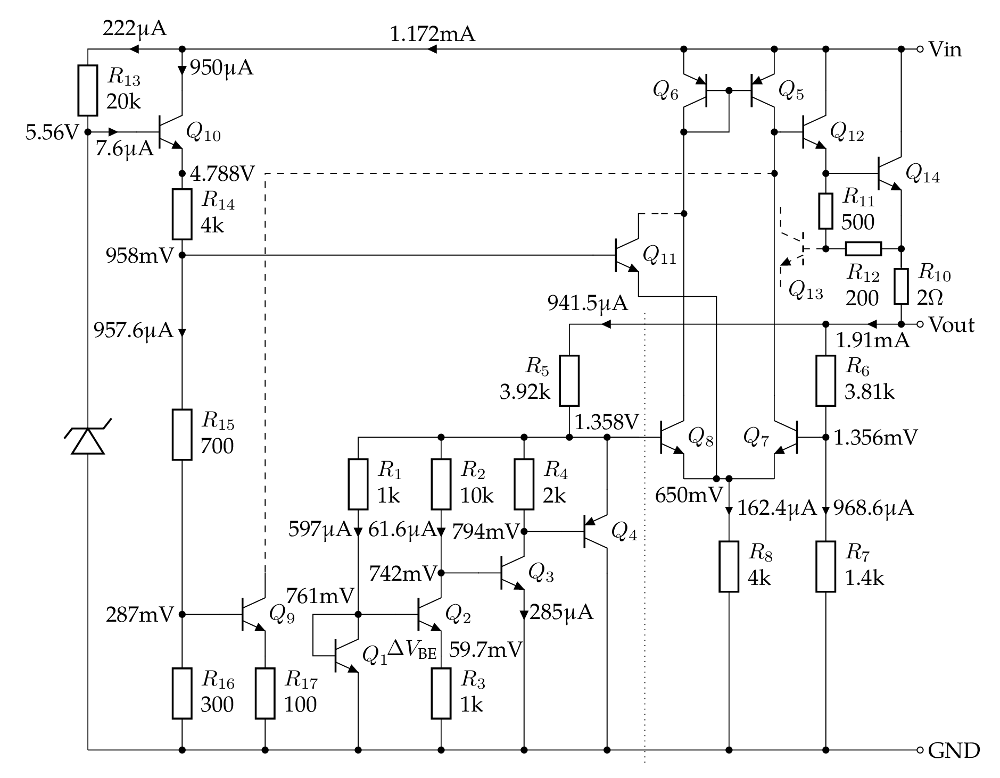
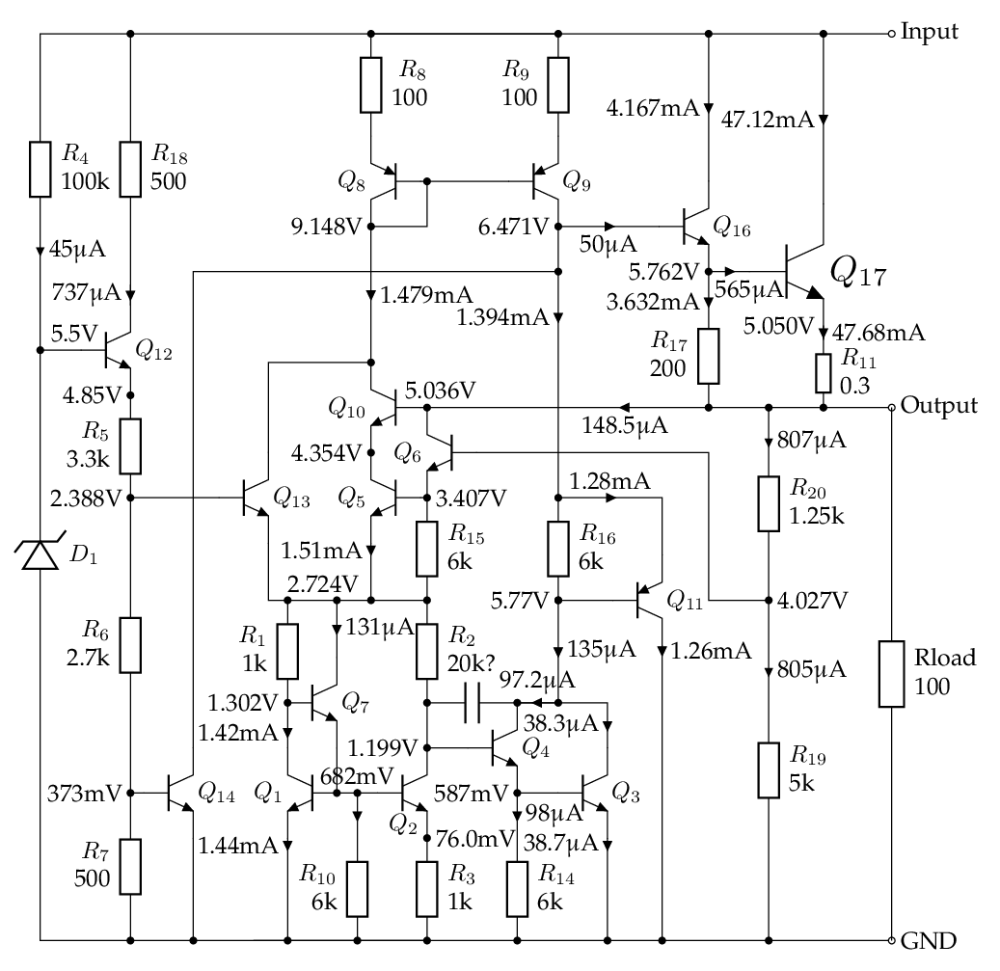
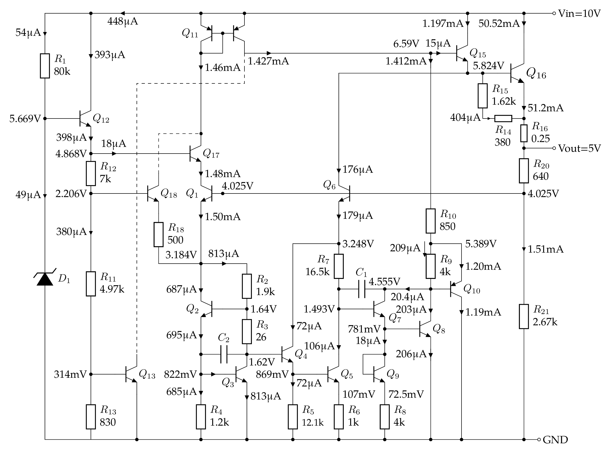
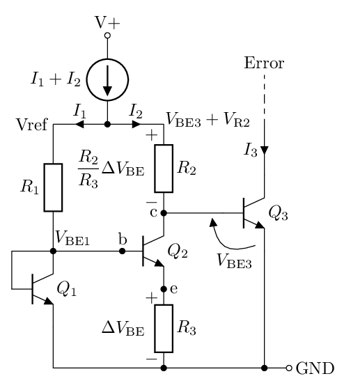
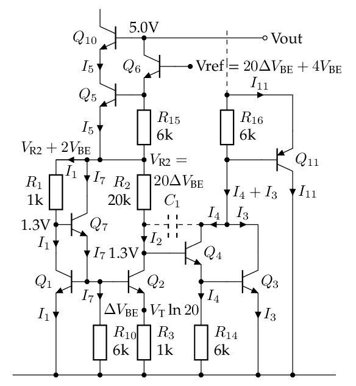
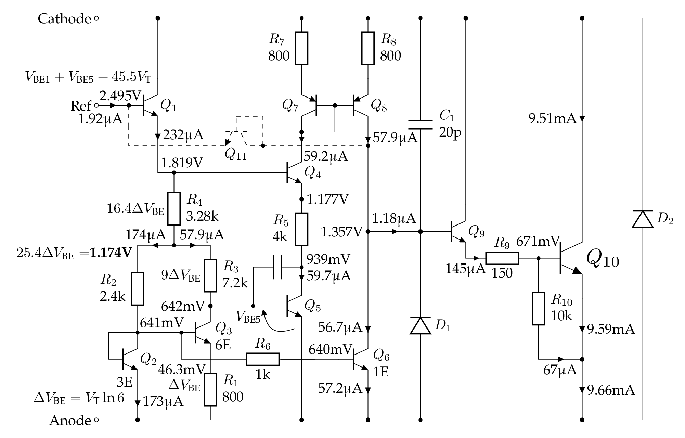

<h1> 常用集成稳压芯片与电压基准 </h1>

## 简史

1960s 分立器件。早期的功率三极管受半导体材料限制，PNP 型是锗管性能较好，NPN 型是硅管性能较好（beta 大、输出电流大、耐压高）。因此，硅集成电路上，以 NPN 管为主，而 PNP 管的 beta 只有几十。早年的功放推挽输出要靠 PNP 锗管和 NPN 硅管配对，比较难搞。

1968 年，Fairchild 上市 [µA723](https://www.ti.com/lit/ds/symlink/ua723.pdf)，输出电流 150mA。根据 µA741 的发明人 [Dave Fullagar 的说法](https://archive.computerhistory.org/resources/text/Oral_History/Fairchild_at_50/102658281.05.01.acc.pdf)，它是 Darryl Lieux 设计的。它内部是用 JFET 做了一个恒流源，驱动 Zener 二极管来获得电压基准 (7.15V)。它使用较为复杂、一般要接五六个外围阻容元件。如需大电流，还需要外接功率三极管。

1969 [Robert Widlar](https://en.wikipedia.org/wiki/Bob_Widlar) (当时在 National 工作) 发明了 bandgap voltage reference，并为 National 设计了第一个集成 5V 三端稳压电路 LM109/LM309，[设计思路](http://www.ti.com/lit/an/snva512b/snva512b.pdf)、[1971 年数据手册](img/lm109-1971.pdf)。输出电流达到 1A，说明温度系数很好。

[1971 年 Fairchild 发布 µA7800](img/ua7800-1971.pdf) 系列三端稳压电路，采用的是 4 Vbe 的基准。
[有人推测](https://www.righto.com/2014/09/reverse-engineering-counterfeit-7805.html)是为了避免电路专利纠纷。

[1972 年 National 发布 LM340-xx](img/lm340-1972.pdf) 系列三端稳压电路，[后来改名为 LM78xx](img/lm7800-1980.pdf) (估计是跟风 Fairchild)。
这个系列采用的是 3 Vbe 的基准，据说跟 [LM109 的电路](img/lm109-jlh1982.pdf)很相似，只是加了电阻分压反馈来获得 12V / 15V 的输出。Robert Widlar 1970 年 33 岁时从 National 退休，我猜他可能参与了 LM7805 的设计，但没有直接证据。

所以，从内部电路上看（存在多个修订版本，暂略），National 的 LM340-5.0 = 自家的 LM7805 != Fairchild 的 µA7805，尽管通常可以互换使用。国内仿制的 W7800 系列电路是参照 Fairchild 的 µA7805 设计，也是 4 Vbe 的基准。

TO-220 封装的 LM7805 的 pin 1 是输入，pin 2 是 GND，pin 3 是 5V 输出。
有一些旧的资料把 pin 2 和 pin 3 互换，我猜是 TO-3 金属封装的遗迹，因为金封 LM7805
的两个管脚是 Vin 和 Vout，而外壳接 GND，一般把金属外壳当作 pin 3，所以旧的资料说 pin 3 是 GND。

1976 [Robert C. Dobkin](https://en.wikipedia.org/wiki/Bob_Dobkin) 发明了 [LM317](https://en.wikipedia.org/wiki/LM317)，第一个可调三端稳压器件。
同年？[Robert A. Pease](https://en.wikipedia.org/wiki/Bob_Pease) 发明了 LM337，负电压可调三端稳压。

1978 TI 发布了可调电压基准 TL431。[1977 年“预告”](https://frank.pocnet.net/other/sos/TexasInstruments_TheVoltageRegulatorHandbook_1977.pdf)，1978 年上市。经典的开关电源控制芯片 TL494 是跟 TL431 是同年上市的。

## LM7805 内部电路简析

<https://www.righto.com/2014/09/reverse-engineering-counterfeit-7805.html>

现在的 datasheet 没有具体参数(电阻阻值)，要看旧图。
即便如此，三极管的参数(beta、面积比)也无从得知。

78L05 的电路比 7805 要容易理解得多，建议从此入手。
μA78L05 内部电路的分析与仿真 <https://chenshuo.github.io/notes/UA78L05>

这是我仿真得到的 μA78L05 直流工作点：

LM7805 与 μA7805 内部电路的分析与仿真 <https://chenshuo.github.io/notes/LM7805>

这是我仿真得到的 μA7805 直流工作点：

这是用[网上找的 SPICE 模型](https://github.com/kafana/ltspice-misc/blob/master/models/regulators.lib)仿真的 LM7805 直流工作点：

**一个猜想**

从三极管的编号可以推测电路的设计过程。7805 是 1970 年左右设计的，当时可没有什么 EDA 软件。鼠标是 1968 年才发明，第一个图形界面的计算机是 1973 年上市（[Xerox Alto](https://en.wikipedia.org/wiki/Xerox_Alto)），Unix 是 1974 年对外发布，SPICE 也是 1973 年发表第一版。所以我推测 7805 是手工计算+画图来设计的，设计步骤会以纸质文档的方式保存下来。那么更改三极管的编号就不是电子文档里“查找+替换”那么简单。所以三级管的编号一定程度上可以推测电路的设计过程，这里以 μA7805 的 bandgap 基准部分为例：**我猜**，一开始的设计是常规的 3 个三极管：

假设 \(V_\mathrm{BE1}\approx V_\mathrm{BE3}\)，那么 \(R_1\) 和 \(R_2\) 上的电压基本相等，所以 \(I_1=\dfrac{R_2}{R_1}{I_2}\)，于是 \(R_3\) 上的电压 \(V_\mathrm{R3} =\Delta V_\mathrm{BE} = V_\mathrm{T}\ln \dfrac{R_2}{R_1}\). \(R_2\) 上的电压 \(V_\mathrm{R2} = \dfrac{R_2}{R_3} \Delta V_\mathrm{BE} = \dfrac{R_2}{R_3} \ln \dfrac{R_2}{R_1} \Delta V_\mathrm{T}\).

随后发现可能 \(Q_3\) 的增益不够，或者其他原因，需要加一个 \(Q_4\) 做 Darlinton。这样一来，\(Q_2\) 集电极的电压就变成了 \(V_\mathrm{BE4} + V_\mathrm{BE3} \approx 2 V_\mathrm{BE}\approx 1.3\)V，为了把 \(Q_1\) 集电极的电压也升高为 \(2 V_\mathrm{BE}\)，就加入了 \(Q_7\)。然后为了释放 \(Q_7\) 的发射极电流，又增加了 \(R_{10}\) 这个泻流电阻。同理，\(R_{14}\) 是给 \(Q_4\) 泻流用的。于是电路就变成了现在这个样子，三极管的编号也就这么确定下来了。

## TL431

TL431 内部电路的分析与计算： <https://chenshuo.github.io/notes/tl431>

这是我仿真得到的 TL431 直流工作点：

我怀疑 TI 公布的内部电路留了一手，手册上给的内部电路参数可以符合直流和交流特性，但是不一定符合温度特性。

## LM185

<https://www.righto.com/2022/04/reverse-engineering-lm185-voltage.html>

## AD580

## 参考

*  Bob Pease "The Design of Band-Gap Reference Circuits: Trials and Tribulations", https://www.tayloredge.com/reference/Ganssle-Pease/bobpease-bandgap.pdf

* 1971 年 Fairchild [Linear Integrated Circuits Data Catalog](https://bitsavers.org/components/fairchild/_dataBooks/1971_Fairchild_Linear_Integrated_Circuits_Data_Catalog.pdf) 出现了 μA7800，[当时的广告](img/ua7800-1972jan.pdf)

* 1972 年 National Semiconductor [Linear Integrated Circuits](https://bitsavers.org/components/national/_dataBooks/1972_National_Linear_Integrated_Circuits.pdf) 有 LM340，也就是后来的 LM7800

* 1974 年 Fairchild [Voltage Regulator Applications Handbook](https://bitsavers.org/components/fairchild/_dataBooks/1974_Fairchild_Voltage_Regulator_Applications_Handbook.pdf) 介绍了 μA7805 内部工作原理

* 1977 年 TI [Voltage Regulator Handbook](https://frank.pocnet.net/other/sos/TexasInstruments_TheVoltageRegulatorHandbook_1977.pdf) 宣布 TL431 即将上市

* 1977 年 Signetics [Analog Data Manual](http://www.bitsavers.org/components/signetics/_dataBooks/1977_Signetics_Analog_Data_Manual.pdf)

* 1980 年 National Semiconductor [Voltage Regulator Handbook](https://media.searchelec.com/specshee/NATIONAL/NationalSemiconductorVoltageRegulatorHandbook1980_text.pdf)

* Linden T. Harrison, _Current Sources and Voltage References_, 2005.
